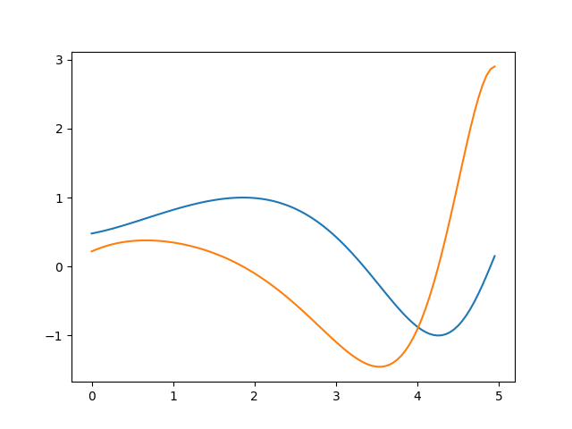

# About

This is a very simple implementation of automatic differentation I made some time ago (when i was learning about neural networks/backpropagation).


## Example

Take as an example the function


The derivative of this function is the rather lengthy and complicated expression


In order to evaluate the derivative at a specific point, one can represent this function as a composition of easier functions. In my implementation, this looks representation looks like

```c++
AutoDiffFunction* func = FunctionFactory::sin(
    FunctionFactory::div(
        FunctionFactory::sqrt(
            FunctionFactory::add(
                FunctionFactory::(FunctionFactory::x()),
                FunctionFactory::pow(FunctionFactory::x(), 2))
            ),
        FunctionFactory::c(2.0f)
    )
);
```

Now, it is possible to calculate the derivative by using the chain rule,


to get the derivative of the overall function with respect to the input at a specific location.

 A plot of the original function (blue) and of the derivative (orange) is shown in the following. As the derivative is the rate of change of the function, one can verify that the result looks promising.  

